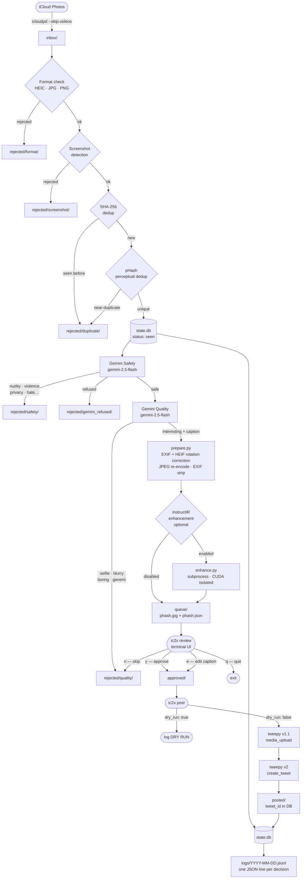

# ic2x — iCloud → X Photo Uploader

Automated pipeline that pulls photos from iCloud, runs Gemini AI safety and quality checks, optionally enhances image quality via InstructIR, queues photos for manual terminal review, then posts approved photos to X (Twitter).

## Pipeline



## Commands

```bash
ic2x run      # pull from iCloud, filter, dedup, Gemini checks, queue
ic2x review   # terminal UI: approve / skip / edit caption / quit
ic2x post     # post all approved photos to X
ic2x unstick  # reset rows stuck in 'posting' back to 'approved' for retry
```

## Setup

```bash
pip install -e .
cp .env.example .env   # fill in API keys
# edit config.yaml: icloud.username, paths, enhance settings
```

### Required keys in `.env`

```bash
TWITTER_CONSUMER_KEY=
TWITTER_CONSUMER_SECRET=
TWITTER_ACCESS_TOKEN=
TWITTER_ACCESS_TOKEN_SECRET=
GEMINI_API_KEY=
```

### config.yaml highlights

| Key | Default | Notes |
|-----|---------|-------|
| `icloud.recent_count` | 50 | Max photos pulled per run |
| `x.dry_run` | `true` | Set `false` only when pipeline is trusted |
| `enhance.enabled` | `false` | InstructIR local enhancement (needs GPU) |
| `limits.daily_ai_calls` | 200 | Hard abort across safety + quality calls |
| `limits.hamming_threshold` | 12 | Perceptual dedup sensitivity (Hamming distance ≤ threshold) |

## Rejection stages

| Folder | Reason |
|--------|--------|
| `rejected/format/` | Non-image file type |
| `rejected/screenshot/` | Detected as device screenshot |
| `rejected/duplicate/` | SHA-256 or perceptual duplicate of seen/posted image |
| `rejected/safety/` | Gemini flagged nudity, violence, privacy, etc. |
| `rejected/gemini_refused/` | Gemini refused to analyse — treated as unsafe |
| `rejected/quality/` | Gemini judged not interesting, or reviewer said no |

## State machine

```
seen → queued → approved → posting → posted
```

`posting` is the idempotency anchor: written before the API call, `posted` written after. Any row stuck in `posting` on startup triggers a warning and halts — never silently retried.
